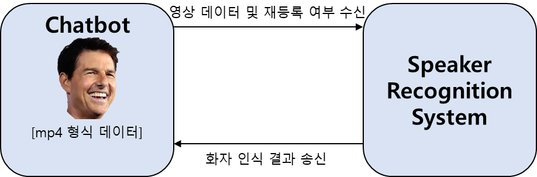
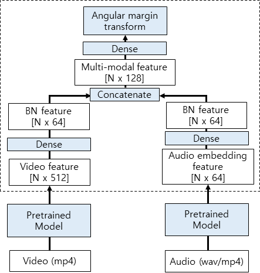

[Flagship] speaker recognition module
======================

#### 0. Note

* (2020/12) 최종 학습 코드 제출을 위한 마스터 버전이 업데이트 되었습니다.

#### 1. 서버 환경

* OS : Ubuntu 16.04
* GPU driver : Nvidia CUDA 10.1

#### 2. System/SW Overveiw

* 개발 목표: 새로 입력된 화자에 대하여 음성, 영상 화자 인식기를 이용하여 별다른 로그인 없이 누구인지 맞출 수 있어야 한다.
* 최종 결과물:
 

#### 3. How to install

> pip install -r requirements.txt

#### 4. Main requirement

* Python 3.5
* tensorflow-gpu 1.12.0 
* Keras 2.2.5 (2.3 이상은 안됨)

#### 5. Network Architecture and features

* **Model:**
* We used dense layer to integrate image and voice model
* After concatenating their feature, final feature is fed into dense layer.

#### 6. Dataset
* Youtube Faces 데이터셋
* 1595명의 화자에 대해 3425개의 비디오셋으로 구성. 각 비디오는 frame 별로 이미지 데이터가 존재함

#### 7. Quick start

> python train_nets.py
