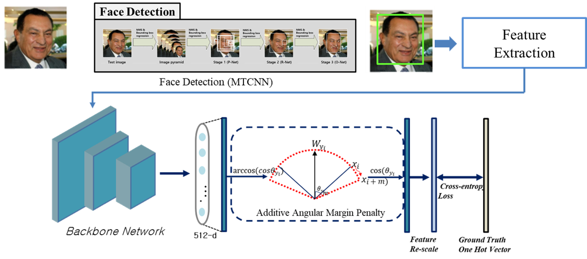
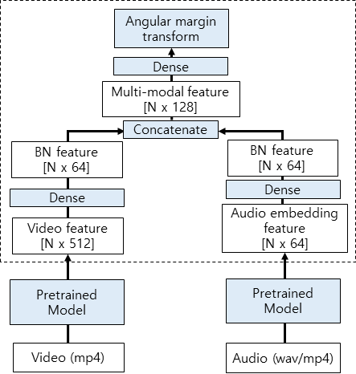

[Flagship] speaker recognition module
======================

#### 0. Note

* (2020/4/29) 4월 마스터 버전이 업데이트 되었습니다.
* (2020/5/29) 5월 마스터 버전이 업데이트 되었습니다.
> 7개의 화자로 구성된 전체 샘플(각 class당 10개, 총 70)에 대한 테스트 코드 첨부하였습니다.
* (2020/6/18) 6월 1차 정식 코드 버전이 업데이트 되었습니다.
> Test : True 일 경우 모든 샘플 데이터에 대한 Identification accuracy가 나오며 False로 설정할 경우 한 이미지에 대한 identification 결과를 얻을 수 있습니다.
* (2020/10/23) 최종 제출을 위한 마스터 버전이 업데이트 되었습니다.
> 과제 최종 코드의 통합 시스템에 따라 pytorch를 tensorflow로 모두 변환(network, app.py, app_web.py)하였고 통합 네트워크 설계하여 Final_result 부분 추가하였습니다.
* (2020/11/10) 최종 제출을 위한 마스터 버전이 업데이트 되었습니다.
> 음성 화자 인식 모델 로드에 문제가 있는 부분을 해결하여 최종 Test 코드를 완성하였습니다.
* (2020/12/29) UTF-8 형식의 코드 수정을 완료하였습니다.

#### 1. 서버 환경

* OS : Ubuntu 16.04
* GPU driver : Nvidia CUDA 9.0 이상

#### 2. System/SW Overveiw

* 개발 목표: 새로 입력된 화자에 대하여 음성, 영상 화자 인식기를 이용하여 별다른 로그인 없이 누구인지 맞출 수 있어야 한다.
* 최종 결과물:
 

#### 3. How to install

> pip install -r requirements.txt

#### 4. Main requirement

* Python 3.5
* tensorflow-gpu 1.12.0 
* Keras 2.2.5 (2.3 이상은 안됨)

#### 5. Network Architecture and features

* **Model:**
* We used depthwise separable convolution as a CNN-based lightweight network.
* The number of parameters is 1/20 times lighter than the existing ResNet, and the amount of computational cost is also much less

* **Metrics:**
* Accuracy is divided into identification and verification, each performance is about 99% and 77%
* Each image extracts 512-dimensional features through the network
* It uses **cosine similarity** and is calculated by dividing the absolute value by the dot product.
* It has a value from -1 to 1 and uses the value to find the nearest speaker (The closer its value near 1, the more similar the target is.)

* **Dataset:**
* Youtube Faces 데이터셋
* 1595명의 화자에 대해 3425개의 비디오셋으로 구성. 각 비디오는 frame 별로 이미지 데이터가 존재함

* **Model:**
* We used dense layer to integrate image and voice model
* After concatenating their feature, final feature is fed into dense layer.

#### 6. Quick start

* 2개의 방법으로 이용할 수 있다

##### 1. 터미널로 이용하는 방법

> python app.py를 실행하고 주소가 실행됨을 확인한다 ex)http://127.0.0.1:5000/
> python Request.py를 실행하여 Input을 전달해주면 다음과 같은 response를 얻는다.
> * {"100001": "Multi-modal Speaker Recognition - Speaker ID : OOOO", "100002": "Image Based Speaker Recognition - Speaker ID : OOOO", "100003": "Voice Based Speaker Recognition - Speaker ID: OOOO"}

##### 2. Web 상에서 이용하는 방법

> python app_web.py를 실행한 후 생기는 주소로 들어간다.
> "Try it out"을 눌러 Input 형식에 맞게 입력값을 넣어주고 실행시킨 후 response를 얻을 수 있다.

##### 3. Training 방법

> ./train 경로에 들어가 python train_nets.py 로 실행가능하다.
> 데이터셋의 경우 YoutubeFace을 사용하였고 해당 데이터는 ./dataset에 경로에 넣어주면 된다.

#### 7. HTTP-server API description

* path

> /SSD/project/ai_5th/flask_v2

* Parameter

|Parameter|Type|Description|
|---|---|---|
|name|string|string of target's mp4 file name|
|path_dir|string|root path|
|re_register|string|when you've registered before, but the feature doesn't express you properly. you can use re_register=True| 

* Request

> '''
> data: {
> 'name': '이메일-번호.mp4'
> 'ip_address': 'http://0.0.0.0:5000/Identification_Request'
> 'path_dir': '/SSD/project/ai_5th/flask_v2/'
> 're_register': 'False'
> }
> '''

* Response OK

> '''
> 200 success
> {
> "100001" : "Multi-modal Speaker Recognition - Speaker ID : OOOO"
> }

#### 8. Repository overview

* 'utils/' -갤러리 저장, 존재여부, identification 코드
* 'data/' -타겟 데이터로 mp4형식으로 저장되어 있음
* 'network/' -음성/영상 인식 네트워크
* 'align/' -얼굴 부분을 추출하기 위한 전처리 코드
* 'best_model/' -model weight 파일
* 'gallery/voice_gallery' -화자가 처음 등록될 때 얻은 feature를 저장해두는 공간
